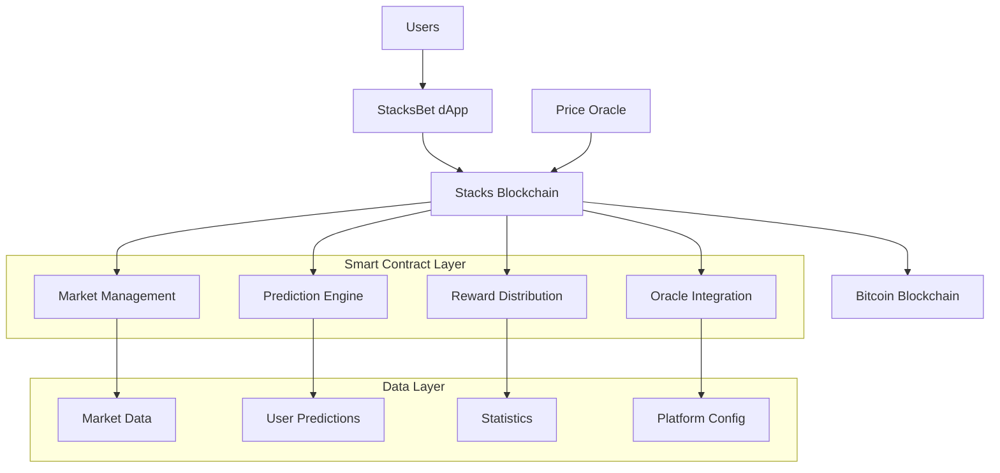
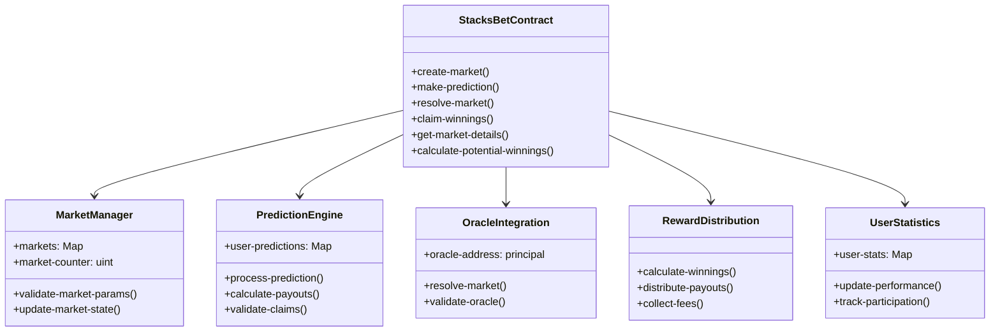
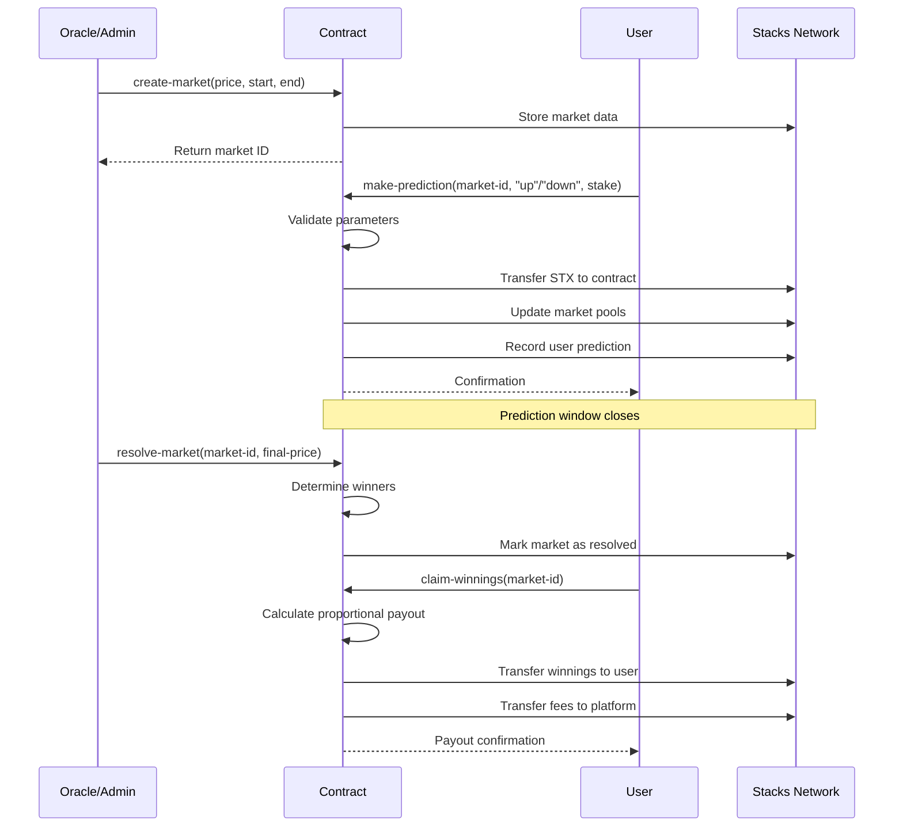
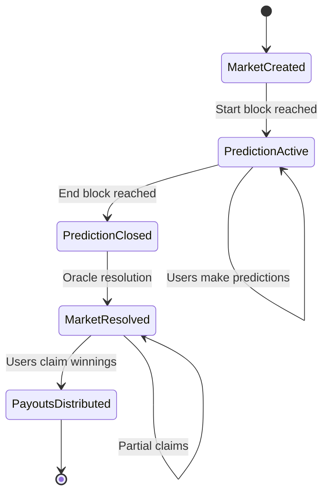

# StacksBet - Decentralized Bitcoin Price Prediction Markets

[](https://stacks.org)
[](https://bitcoin.org)
[](https://clarity-lang.org)

## 🚀 Overview

StacksBet is a revolutionary decentralized prediction market platform built on Stacks Layer 2, enabling users to stake STX tokens on Bitcoin price movements. By leveraging Bitcoin's security and Stacks' smart contract capabilities, StacksBet creates a trustless, transparent, and engaging DeFi experience for Bitcoin price speculation.

### Key Features

- **🔮 Oracle-Driven Settlement** - Automated market resolution with verified price feeds
- **⚡ Instant Payouts** - Proportional reward distribution to winners
- **🛡️ Anti-Manipulation** - Built-in safeguards and minimum stake requirements
- **📊 Real-Time Analytics** - Comprehensive user statistics and market insights
- **🔒 Trustless Operations** - No intermediaries, fully decentralized execution
- **💎 Bitcoin-Native** - Direct integration with Bitcoin's Layer 2 ecosystem

## 🏗️ System Architecture

### High-Level Architecture



### Contract Architecture



## 📊 Data Flow

### Market Creation & Prediction Flow



### State Management Flow



## 🔧 Technical Specifications

### Smart Contract Details

| Component | Description | Type |
|-----------|-------------|------|
| **Markets Map** | Core market data storage | `uint → market-data` |
| **User Predictions** | Individual prediction tracking | `{market-id, user} → prediction-data` |
| **User Statistics** | Performance metrics | `principal → stats-data` |
| **Oracle Integration** | External price feed validation | `principal` |
| **Fee Management** | Platform revenue collection | `percentage-based` |

### Data Structures

#### Market Data Structure

```clarity
{
  start-price: uint,        ;; Bitcoin price at market open (satoshis)
  end-price: uint,          ;; Final Bitcoin price for resolution
  total-up-stake: uint,     ;; Total STX staked on bullish predictions
  total-down-stake: uint,   ;; Total STX staked on bearish predictions
  start-block: uint,        ;; Prediction window start
  end-block: uint,          ;; Prediction window end
  resolution-block: uint,   ;; When market was resolved
  resolved: bool,           ;; Resolution status
  creator: principal        ;; Market creator address
}
```

#### User Prediction Structure

```clarity
{
  prediction-type: (string-ascii 4),  ;; "up" or "down"
  stake-amount: uint,                 ;; STX staked (microSTX)
  timestamp: uint,                    ;; Prediction block height
  claimed: bool,                      ;; Reward claim status
  potential-payout: uint              ;; Calculated winnings
}
```

## 🚦 Getting Started

### Prerequisites

- Stacks wallet (Hiro Wallet, Xverse, etc.)
- STX tokens for staking
- Basic understanding of Bitcoin price movements

### Installation & Deployment

1. **Clone the repository**

   ```bash
   git clone https://github.com/kentomson01/stacksbet.git
   cd stacksbet
   ```

2. **Install dependencies**

   ```bash
   npm install
   # or
   yarn install
   ```

3. **Deploy to Stacks Network**

   ```bash
   clarinet deploy --network testnet
   ```

4. **Verify deployment**

   ```bash
   clarinet console
   ```

### Usage Examples

#### Create a New Market (Admin Only)

```clarity
(contract-call? .stacksbet create-market u5000000000 u1000 u1100)
;; Creates market with BTC at 50,000 sats, 100-block prediction window
```

#### Make a Prediction

```clarity
(contract-call? .stacksbet make-prediction u0 "up" u5000000)
;; Stake 5 STX on Bitcoin price going up in market 0
```

#### Claim Winnings

```clarity
(contract-call? .stacksbet claim-winnings u0)
;; Claim proportional winnings from resolved market 0
```

#### Check Market Status

```clarity
(contract-call? .stacksbet get-market-status u0)
;; Returns market activity status and remaining blocks
```

## 📈 Economic Model

### Reward Distribution

- **Winner's Share**: Proportional to stake in winning pool
- **Platform Fee**: 2.5% of gross winnings (configurable)
- **Fee Distribution**: 100% to platform treasury

### Example Payout Calculation

```
Market Pool: 1000 STX (600 "up", 400 "down")
Bitcoin Price: Increases (up wins)
User Stake: 60 STX on "up" (10% of winning pool)

User's Gross Winnings: (60 ÷ 600) × 1000 = 100 STX
Platform Fee: 100 × 2.5% = 2.5 STX
Net Payout: 100 - 2.5 = 97.5 STX
```

## 🔐 Security Features

### Built-in Protections

- **Oracle Authorization**: Only authorized addresses can resolve markets
- **Timestamp Validation**: Prevents retroactive predictions
- **Balance Verification**: Ensures sufficient user funds before staking
- **Double-Claim Prevention**: Users can only claim winnings once per market
- **Parameter Validation**: Comprehensive input sanitization

### Audit Considerations

- No external dependencies beyond Stacks blockchain
- Deterministic payout calculations
- Transparent fee structure
- Immutable market parameters post-creation

## 📊 Platform Analytics

### User Metrics Tracked

- Total predictions made
- Lifetime STX staked
- Total winnings claimed
- Win rate percentage
- Participation history

### Platform Statistics

- Total markets created
- Cumulative trading volume
- Active user count
- Platform revenue

## 🛠️ API Reference

### Core Functions

| Function | Access | Description |
|----------|--------|-------------|
| `create-market` | Admin Only | Initialize new prediction market |
| `make-prediction` | Public | Submit price prediction with stake |
| `resolve-market` | Oracle Only | Resolve market with final price |
| `claim-winnings` | Public | Claim proportional winnings |

### Read-Only Functions

| Function | Returns | Description |
|----------|---------|-------------|
| `get-market-details` | Market data | Complete market information |
| `get-user-prediction-details` | Prediction data | User's prediction in specific market |
| `calculate-potential-winnings` | Estimated payout | Potential winnings calculation |
| `get-platform-stats` | Platform metrics | Overall platform statistics |

## 🚀 Roadmap

### Phase 1: Core Platform ✅

- Basic prediction markets
- Oracle integration
- Reward distribution
- User statistics

### Phase 2: Enhanced Features 🔄

- Multi-timeframe markets
- Advanced analytics dashboard
- Mobile app integration
- Social features

### Phase 3: Ecosystem Expansion 📋

- Additional asset predictions
- Liquidity mining rewards
- DAO governance integration
- Cross-chain compatibility

## 🤝 Contributing

We welcome contributions from the community! Please see our [Contributing Guidelines](CONTRIBUTING.md) for details.

### Development Setup

1. Fork the repository
2. Create a feature branch
3. Make your changes
4. Write tests
5. Submit a pull request
